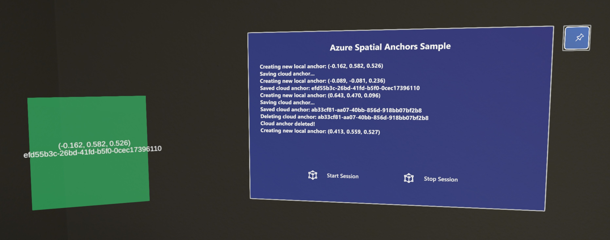

# Azure Spatial Anchors Sample

Supported Unity versions | Built with XR configuration
:-----------------: | :----------------: |
Unity 2020 or higher | OpenXR 0.9.2 |

Azure Spatial Anchors is a cross-platform developer service that allows you to create mixed reality experiences with objects that persist their locations across devices over time.
This sample project shows how to use Azure Spatial Anchors on the HoloLens 2 using Unity and OpenXR.

## Contents

| File/folder | Description |
|-------------|-------------|
| `Assets` | Unity assets, scenes, prefabs, and scripts. |
| `Packages` | Project manifest and packages list. |
| `ProjectSettings` | Unity asset setting files. |
| `UserSettings` | Generated user settings from Unity. |
| `.gitignore` | Define what to ignore at commit time. |
| `README.md` | This README file. |

## Running the app

1. If you don't have an [Azure subscription](https://docs.microsoft.com/en-us/azure/guides/developer/azure-developer-guide#understanding-accounts-subscriptions-and-billing), create a [free account](https://azure.microsoft.com/free/?ref=microsoft.com&utm_source=microsoft.com&utm_medium=docs&utm_campaign=visualstudio) before you begin.
2. Use your Azure subscription to [create a spatial anchors resource](https://docs.microsoft.com/en-us/azure/spatial-anchors/quickstarts/get-started-unity-hololens?tabs=azure-portal#create-a-spatial-anchors-resource).
3. [Configure the account information](https://docs.microsoft.com/en-us/azure/spatial-anchors/quickstarts/get-started-unity-hololens?tabs=azure-portal#configure-the-account-information) to be used in this project, writing the `Account Key`, `Account ID`, and `Account Domain` into `Assets\AzureSpatialAnchors.SDK\Resources\SpatialAnchorConfig.asset`.
4. Build and run the project.
